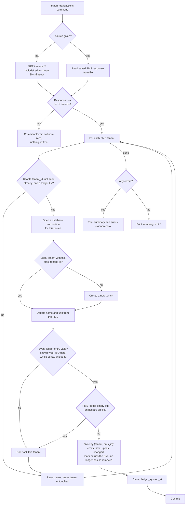
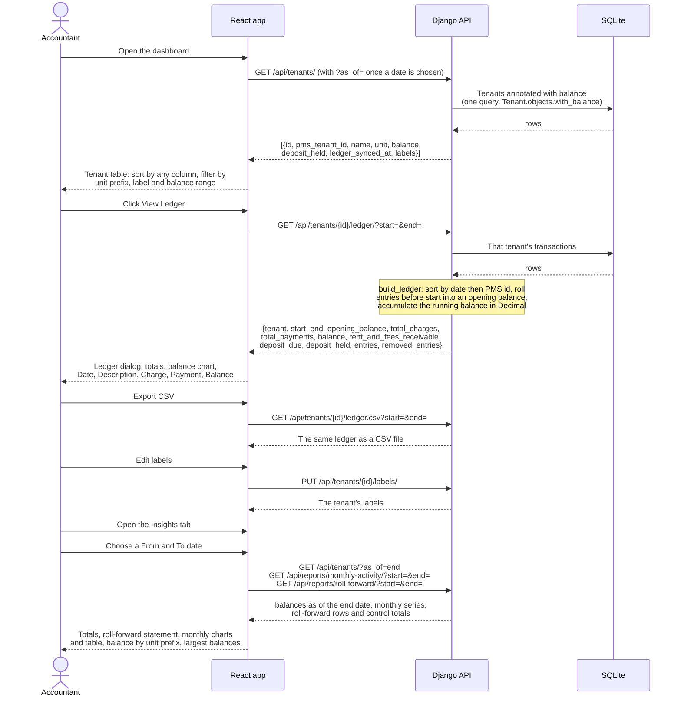
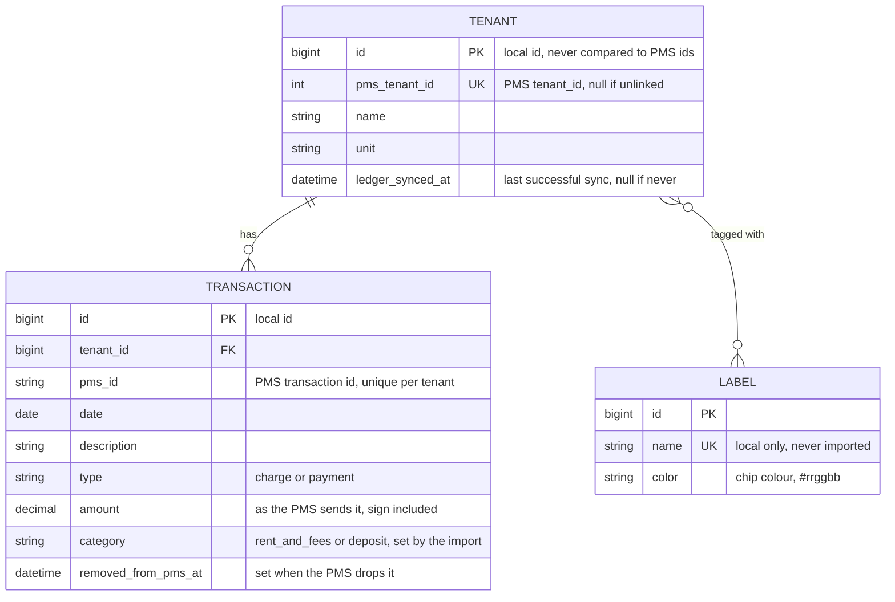

# How the ledger works, end to end

Two flows meet in the local database. The **import** copies tenants and their
ledgers from the PMS into SQLite. The **read path** serves that copy to the
browser. The PMS is never called while a user is looking at a ledger.

## Contents

- [Import: PMS to local database](#import-pms-to-local-database)
- [Read path: View Ledger](#read-path-view-ledger)
- [Data model](#data-model)
- [How the balance is computed](#how-the-balance-is-computed)

## Import: PMS to local database

Run with `python manage.py import_transactions` from `backend/`.



With `--dry-run` the same steps run inside one outer database transaction
that is rolled back at the end, so the counts are real and nothing is written.

Code: `backend/api/management/commands/import_transactions.py` is the thin
command; the rules live in `backend/api/services/pms_import.py`.

## Read path: View Ledger



Code: views in `backend/api/views.py`, balance rules in
`backend/api/services/ledger.py` and `Tenant.objects.with_balance()` in
`backend/api/models.py`, UI in `frontend/src/TenantList.js`,
`frontend/src/TenantLedger.js`, `frontend/src/LabelsTab.js` and
`frontend/src/Insights.js`.

## Data model



## How the balance is computed

The balance is what the tenant owes. It is never stored; it is derived from
the transactions every time, so it cannot drift from them.

```
effect of an entry = amount    when type is "charge"
                   = -amount   when type is "payment"

balance = sum of effects = net charges - net payments
```

Amounts keep the sign the PMS sends, and the type decides the direction:

| PMS entry | Example | Effect on balance |
|---|---|---|
| charge, positive | Rent Charge 1,500 | +1,500 |
| charge, negative | Utility Credit -80 | -80 (a credit) |
| payment, positive | Rent Payment 1,500 | -1,500 |
| payment, negative | Returned Payment - NSF -1,375 | +1,375 (the payment bounced) |

A positive balance is shown as "Balance due", a negative one as "Credit
balance", zero as "Paid in full". A tenant with no transactions at all is
shown as "no activity" rather than "Paid in full". Entries marked as removed
from the PMS are left out of the balance.

The balance is also shown split into rent and fees owed and any security
deposit still owed. Deposit money already received is reported separately as
"Deposit held": it belongs to the tenant, so it is never part of the balance.
